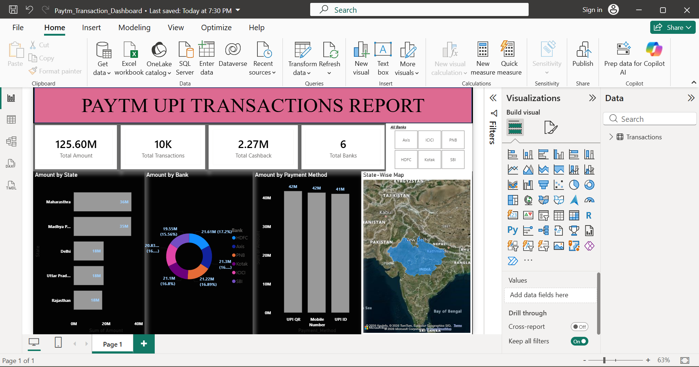

# Paytm-Transaction-Dashboard
# 📊 Paytm Transaction Dashboard

Interactive Paytm Transaction Dashboard built using Excel and AI-assistance.

## 📌 Project Overview
This dashboard analyzes Paytm transaction data to monitor transaction performance, success rate, bank-wise analysis, city-wise trends, and device usage.

## 🛠️ Tools Used
- Microsoft Excel
- Pivot Tables
- Pivot Charts
- Slicers
- Conditional Formatting

## 📂 Dataset
**File:** Paytm_Transactions_Dataset.csv

**Source:** Self-created synthetic dataset for educational purposes.

## 📈 Key KPIs
- Total Transactions
- Successful Transactions
- Failed Transactions
- Total Transaction Amount
- Average Transaction Value
- Success Rate

## 📷 Dashboard Preview
See **Dashboard_Screenshot.png** in this repository
## 📷 Dashboard Preview

